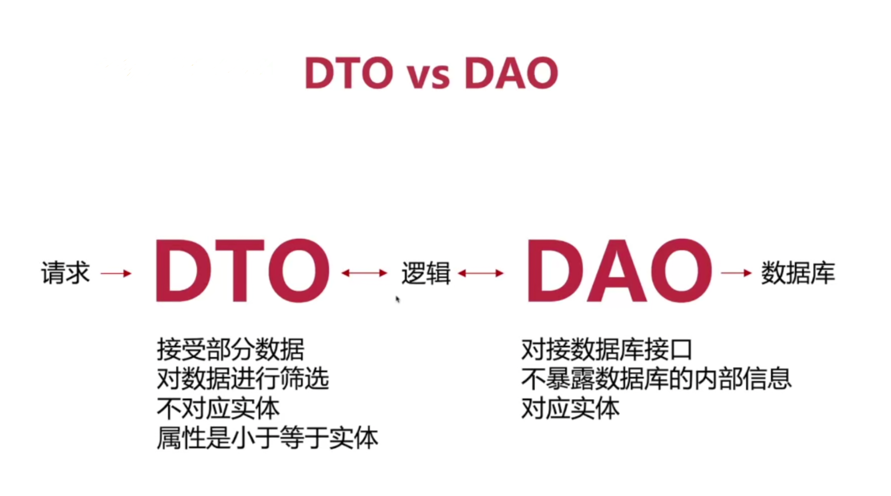

# Nestjs Data Object

> DTO & DAO

## DTO

数据传输对象（**D**data **T**ransfer **O**bject）在 Nestjs 中一般指新增/更新接口中参数对象，会建立对应的文件来存储

## DAO

数据访问对象（**D**data **A**ccess **O**bject）在 Nestjs 中指一层逻辑，包含实体类、服务（数据库操作 curd => orm）、数据校验、错误处理等
