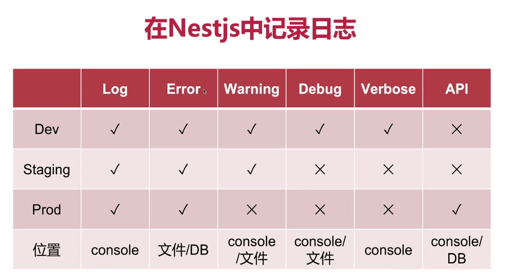

# Log Design

> 主要用途是用来定位问题，方便排查

## 记录点

- 什么时间发生

- 发生了什么事

- 错误是什么

## 解决方案

- winston（适合动手能力强的人）

- pino（懒人必备）

## 开发日志系统

> 服务器日志需要用到定时任务

### 日志按照等级分类

- log：通用日志，按需进行记录（打印）

- warning：警告日志，例如：多次数据库操作

- error：严重日志，例如：数据库异常

- debug：调试日志，例如：加载数据日志

- verbose：详细日志，所有操作与详细信息（非必要不打印）

### 日志按照功能分类

- 错误日志：方便定位问题，给用户友好提示

- 调试日志：方便开发

- 请求日志：记录敏感行为

### 日志记录的位置

- 控制台日志：方便查看、调试

- 文件日志：记录在服务器上方便回溯与追踪（24小时滚动）

- 数据库日志：将敏感操作、敏感数据记录记录在数据库中，主打一个安全

## 日志使用

## 错误全局拦截

