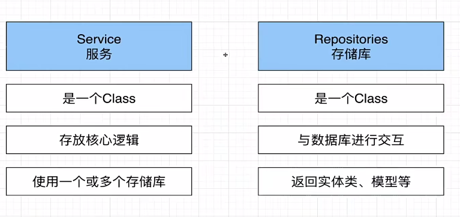

# SQL Tutorial

> SQL(Structured Query Language) 是用于访问和处理数据库的标准的计算机语言

## 基本概念

- 表（Table）：是数据的矩阵，表头展示所有列的名称（该表中包含的所有字段）

- 行（记录）：是一组相关的数据

- 列（数据）：是一组包含了相同类型的数据

- 主键：区分、查询、排序数据

- 外键：关联表

> 可以将表理解为 Class，一行记录是实例化的 Object

## 设计步骤

1. 需求分析

2. 逻辑设计（理清人、物、事的关联关系）

3. 数据库创建（物理创建）

4. 维护与优化（拆分表、拆分库、设置索引等）

## 通用业务模块设计

1. 用户系统（登录、登出，token 标识）

2. 权限系统（菜单、路由跳转，模块显示隐藏）

## 设计范式

请查阅 [数据库设计三大范式](./sql-design.md)

## Service 与 Repository

### 何时拆分

1. service 内部方法数量大于6个

2. 总代码行数大于300行

3. 建议都使用 repository 来操作数据库，方便后面统一替换 orm 框架

## Service 中 typeorm 方法对比

1. delete 硬删除，一般需要数据 id 操作，一般在线上不推荐使用

2. delete 无法触发 typeorm 的钩子函数，详情见：<https://typeorm.io/listeners-and-subscribers>

3. 钩子函数常用于做一些统计操作

4. create 可以触发 afterinsert 钩子函数
