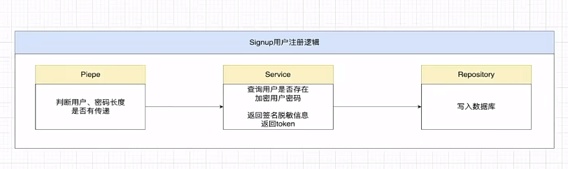
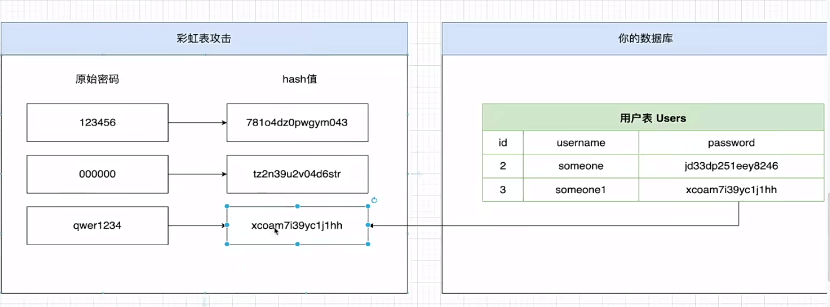
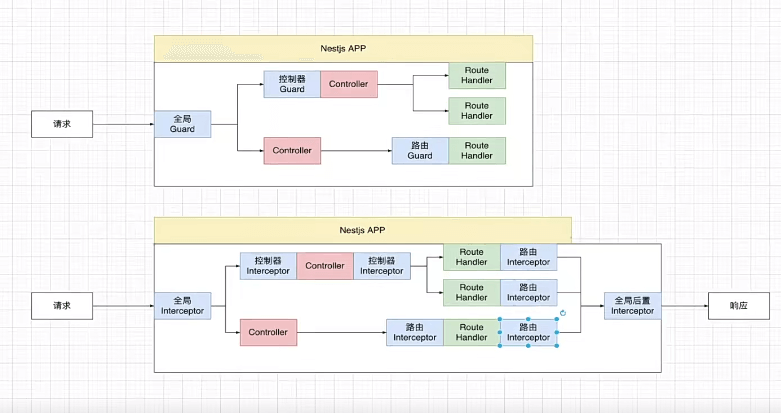
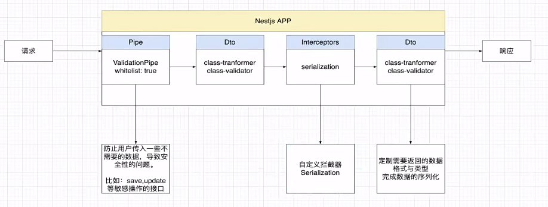

# Desensitization

> 数据脱敏，详情可参考：<https://javaguide.cn/system-design/security/data-desensitization.html>

## User signin & signup

## User attack

## User info desensitization

## User DTO input & output

1. 对于用户通过请求携带的输入数据，开启 valid pipe 中的 whitelist 结合 dto 对输入数据进行过滤

2. 对于服务端返回给用户的输出数据，通过 interceptor 序列化进行脱敏将数据返回
