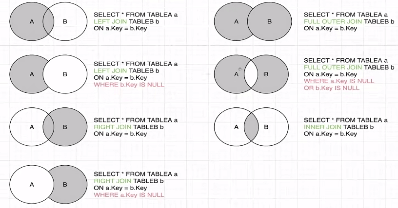

# 数据库设计三大范式

## 一、第一范式

1NF是对属性的**`原子性`**，要求属性具有原子性，不可再分解；

> 表：字段1、 字段2(字段2.1、字段2.2)、字段3 ......

如老师（院系、高级职称人数），如果认为最后一列还可以再分成（教授、副教授），它就不是一范式了，否则就是；

转化第一范式很简单，扁平化即可：

## 二、第二范式

2NF是对记录的**`唯一性`**，要求记录有唯一标识，即实体的唯一性，即**不存在部分依赖**；

> 表：职工号，姓名，职称，项目号，项目名称；

这个表明显说明了两个逻辑关系：职工信息，项目信息；由于非主键字段必须依赖主键，这里**职工号->姓名，职工号->职称，而项目号->项目名称**有依赖关系，所以不符合二范式。

**可能会存在问题：**

- `数据冗余:`，每条记录都含有相同信息；
- `删除异常：`删除所有学生成绩，就把课程信息全删除了；
- `插入异常：`学生未选课，无法记录进数据库；
- `更新异常：`调整课程学分，所有行都调整。

**正确做法:**

> 常用的解决办法是差分表格，比如拆分为：
>
> - 职工信息表（职工ID、职称ID...），或加入职称表（职称表ID、职称、职称等级等）
> - 项目信息表（项目ID、职工ID、项目信息...）

## 三、第三范式

**如果一个关系属于第二范式**，并且在**`两个(或多个)非主键属性之间不存在函数依赖`**。非主键属性之间的函数依赖也称为传递依赖，那么这个关系属于第三范式。

3NF是对字段的**`冗余性`**，要求任何字段不能由其他字段派生出来，它要求字段没有冗余，即**不存在传递依赖**；

> 表: Student表（学号，姓名，年龄，性别，所在院校，院校地址，院校电话）

**注意：**上表属于第二范式，因为主键由单个属性组成（学号）

因为存在**依赖传递**: (学号) → (学生)→(所在学院) → (学院电话) 。

**可能会存在问题：**

- `数据冗余:`有重复值；
- `更新异常：`有重复的冗余信息，修改时需要同时修改多条记录，否则会出现**数据不一致的情况** 。

**正确做法：**

> 学生：(学号， 姓名， 年龄， 所在学院)；
>
> 学院：(学院，学院名称， 电话)。

## 四、反范式化

**一般说来，数据库只需满足第三范式（`3NF`）就行了。**

没有冗余的数据库设计可以做到。但是，没有冗余的数据库未必是最好的数据库，有时为了提高运行效率，就必须降低范式标准，适当保留冗余数据。具体做法是：在概念数据模型设计时遵守第三范式，降低范式标准的工作放到物理数据模型设计时考虑。降低范式就是增加字段，允许冗余，**`达到以空间换时间的目的`**。

例：如订单表，“金额”这个字段的存在，表明该表的设计不满足第三范式，因为“金额”可以由“单价”乘以“数量”得到，说明“金额”是冗余字段。但是，增加“金额”这个冗余字段，可以提高查询统计的速度，这就是以空间换时间的作法。

在`Rose 2002`中，规定列有两种类型：**数据列**和**计算列**。“金额”这样的列被称为“计算列”，而“单价”和“数量”这样的列被称为“数据列”。

## 五、范式化设计和反范式化设计的优缺点

### 5.1 范式化

**优点：**

- 可以尽量减少数据冗余
- 数据表更新快体积小
- 范式化的更新操作比反范式化更快
- 范式化的表通常比反范式化更小

**缺点：**

- 查询需要对多个表进行关联，可能导致性能降低
- 更难进行索引优化

### 5.2 反范式化

**优点：**

- 减少表的关联
- 可以更好的进行索引优化

**缺点：**

- 存在数据冗余及数据维护异常
- 对数据的修改需要更多成本（语句、查询、删除、验证等）

## JOIN 区别

## **参考资料**

[1、通俗地理解数据库三个范式](https://link.segmentfault.com/?enc=BlVBIy2ARDrsX5wClZ8q7A%3D%3D.9JgaTtK2xl31kiRRKn%2Fa6lpc4Z0ynCQ9iMkXKhSz1GoaMV%2FxwLd9JM1ySP0dRhzFbQl%2FFPyjM5Ye4WszRjr4nA%3D%3D)
[2、数据库模型设计，第一范式、第二范式、第三范式简单例子理解](https://link.segmentfault.com/?enc=JERKYOPwkoZEIbXbKDkIkQ%3D%3D.3rSQTRggQ%2FcKAG8Pmd5%2BaFhr3EyguIjHwDvJOGAOKJDrqFV%2FphzMVFtoGWWNVVXgyYfqQ9Q6jR1CejAw3Lwqbg%3D%3D)
[3、数据库三大范式最简单的解释](https://link.segmentfault.com/?enc=IG%2BtrltdH0%2BnrPr%2BWfiUIA%3D%3D.rO36uGTWzMNLuDyJU3s1KaqzVSKoa3OMzRM3RUjkZD9Hj3VATUIkQIynJ4R7WLkoBSW5Aq3cCWzTQmtuBAJ0TA%3D%3D)
